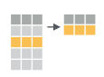

---
# Please do not edit this file directly; it is auto generated.
# Instead, please edit 04-dplyr.md in _episodes_rmd/
title: "Aggregating and Analyzing Data with dplyr"
teaching: 60
exercises: 15
questions:
- "How can I manipulate dataframes without repeating myself?"
objectives:
- "Select certain columns in a data frame with the **`dplyr`** function `select`."
- "Extract certain rows in a data frame according to logical (boolean) conditions with the **`dplyr`** function `filter`."
- "Link the output of one **`dplyr`** function to the input of another function with the 'pipe' operator `%>%`."
- "Add new columns to a data frame that are functions of existing columns with `mutate`."
- "Use the split-apply-combine concept for data analysis."
- "Use `summarize`, `group_by`, and `count` to split a data frame into groups of observations, apply summary statistics for each group, and then combine the results."
- "Employ the ‘split-apply-combine’ concept to split the data into groups, apply analysis to each group, and combine the results."
- "Export a data frame to a .csv file."

keypoints:
- "Use the `dplyr` package to manipulate dataframes."
- "Use `select()` to choose variables from a dataframe."
- "Use `filter()` to choose data based on values."
- "Use `group_by()` and `summarize()` to work with subsets of data."
- "Use `mutate()` to create new variables."
source: Rmd
---


# Data manipulation using **`dplyr`** and **`tidyr`** from **`tidyverse`** package

Bracket subsetting is handy, but it can be cumbersome and difficult to read,
especially for complicated operations. Enter **`dplyr`**. **`dplyr`** is a package for
making tabular data manipulation easier. It pairs nicely with **`tidyr`** which enables you to swiftly convert between different data formats for plotting and analysis.

The **`tidyverse`** package is an "umbrella-package" that installs **`tidyr`**, **`dplyr`**, and several other packages useful for data analysis, such as  **`ggplot2`**, **`tibble`**, etc.

The **`tidyverse`** package tries to address 3 common issues that arise when
doing data analysis with some of the functions that come with R:

1. The results from a base R function sometimes depend on the type of data.
2. Using R expressions in a non standard way, which can be confusing for new
   learners.
3. Hidden arguments, having default operations that new learners are not aware
   of.

First we have to make sure we have the `tidyverse` package (including `dplyr` 
and `tidyr`) installed. 

#### Install `tidyverse`

**ON NOTABLE RSTUDIO SERVER:**

If you're using the EDINA Notable RStudio Server, `tidyverse` is already installed,
so you can skip this step. It's worth knowing how to install a package for future 
though, so check out the instructions for locally-installed RStudio.

**ON LOCAL RSTUDIO:**

Install the package you want by using the `install.package()` function, with the 
name of the package you want inside the brackets, within quotes. 
If you get an error, make sure you've spelled the package name correctly.


~~~
install.packages("tidyverse") ## install tidyverse
~~~
{: .language-r}

You might get asked to choose a CRAN mirror -- this is asking you to
choose a site to download the package from. The choice doesn't matter too much; I'd recommend choosing the RStudio mirror.

#### Load `tidyverse` package

To load the package (whether in Notable or running RStudio locally), type (without quotes this time!):


~~~
## load the tidyverse packages, incl. dplyr
library(tidyverse)
~~~
{: .language-r}

You only need to install a package once per computer, but you need to load it
every time you open a new R session and want to use that package.

## What are **`dplyr`** and **`tidyr`**?

The package **`dplyr`** provides easy tools for the most common data manipulation
tasks. It is built to work directly with data frames, with many common tasks
optimized by being written in a compiled language (C++). An additional feature is the
ability to work directly with data stored in an external database. The benefits of
doing this are that the data can be managed natively in a relational database,
queries can be conducted on that database, and only the results of the query are
returned.

This addresses a common problem with R in that all operations are conducted
in-memory and thus the amount of data you can work with is limited by available
memory. The database connections essentially remove that limitation in that you
can connect to a database of many hundreds of GB, conduct queries on it directly, and pull
back into R only what you need for analysis.

The package **`tidyr`** addresses the common problem of wanting to reshape your data for
plotting and use by different R functions. Sometimes we want data sets where we have one
row per measurement. Sometimes we want a data frame where each measurement type has its
own column, and rows are instead more aggregated groups
(e.g., a time period, an experimental unit like a plot or a batch number).
Moving back and forth between these formats is non-trivial, and **`tidyr`** gives you tools
for this and more sophisticated  data manipulation.

To learn more about **`dplyr`** and **`tidyr`** after the workshop, you may want to check out this
[handy data transformation with **`dplyr`** cheatsheet](https://github.com/rstudio/cheatsheets/raw/master/data-transformation.pdf)
and this [one about **`tidyr`**](https://github.com/rstudio/cheatsheets/raw/master/data-import.pdf).


As before, we'll read in our variants data: 

~~~
variants <- read.csv("https://ndownloader.figshare.com/files/14632895")
~~~
{: .language-r}

We then want to check our variants object: 


~~~
## inspect the data
str(variants)
~~~
{: .language-r}


~~~
## preview the data
view(variants)
~~~
{: .language-r}

<!-- COLUMN NAME INFO FOR VARIANTS DATA: "Explore the VCF format" section: --> 
<!-- https://datacarpentry.org/wrangling-genomics/04-variant_calling/index.html -->

Next, we're going to learn some of the most common **`dplyr`** functions as well 
as using pipes to combine them:

If we think about our data as rectangular, these illustrations from the 
[**dplyr data transformation cheatsheet**](https://rstudio.com/resources/cheatsheets/) 
help us understand how they manupulate the data frame.

- `select()`: subset columns


- `filter()`: subset rows on conditions



- `mutate()`: create new columns by using information from other columns


- `group_by()` and `summarize()`: create summary statistics on grouped data

 

- `count()`: count discrete values


### Selecting columns and filtering rows

Using bracket notation, in order to pull out certain columns, we would have to 
know which index referred to that column, which took an extra step, and if we 
had re-ordered our columns or added one in the middle, the indexes in our script
would suddenly refer to the 'wrong' column, which might cause confusion!

As a refresher, here's how we pulled out columns using the bracket notation: 

~~~
# get columns: sample_id, REF, ALT, DP
variants[, c(1, 5, 6, 12)]
~~~
{: .language-r}


~~~
   sample_id      REF       ALT DP
1 SRR2584863        T         G  4
2 SRR2584863        G         T  6
3 SRR2584863        G         T 10
4 SRR2584863 CTTTTTTT CTTTTTTTT 12
5 SRR2584863     CCGC    CCGCGC 10
6 SRR2584863        C         T 10
~~~
{: .output}

But our code isn't very easy to understand and we'd need to see the output to make 
sure we had the correct columns.

Enter `dplyr`!

#### How to **`select()`** columns

To select columns of a data frame, use `select()`. The first argument to this 
function is the data frame (`variants`), and the subsequent arguments are the 
columns to keep.


~~~
select(variants, sample_id, REF, ALT, DP)
~~~
{: .language-r}


~~~
   sample_id      REF       ALT DP
1 SRR2584863        T         G  4
2 SRR2584863        G         T  6
3 SRR2584863        G         T 10
4 SRR2584863 CTTTTTTT CTTTTTTTT 12
5 SRR2584863     CCGC    CCGCGC 10
6 SRR2584863        C         T 10
~~~
{: .output}

This code is much easier to understand!

To select all columns *except* certain ones, put a "-" in front of
the variable to exclude it.


~~~
select(variants, -CHROM)
~~~
{: .language-r}


~~~
   sample_id    POS ID      REF       ALT QUAL FILTER INDEL IDV IMF DP
1 SRR2584863   9972 NA        T         G   91     NA FALSE  NA  NA  4
2 SRR2584863 263235 NA        G         T   85     NA FALSE  NA  NA  6
3 SRR2584863 281923 NA        G         T  217     NA FALSE  NA  NA 10
4 SRR2584863 433359 NA CTTTTTTT CTTTTTTTT   64     NA  TRUE  12 1.0 12
5 SRR2584863 473901 NA     CCGC    CCGCGC  228     NA  TRUE   9 0.9 10
6 SRR2584863 648692 NA        C         T  210     NA FALSE  NA  NA 10
        VDB RPB MQB BQB     MQSB       SGB     MQ0F ICB HOB AC AN     DP4 MQ
1 0.0257451  NA  NA  NA       NA -0.556411 0.000000  NA  NA  1  1 0,0,0,4 60
2 0.0961330   1   1   1       NA -0.590765 0.166667  NA  NA  1  1 0,1,0,5 33
3 0.7740830  NA  NA  NA 0.974597 -0.662043 0.000000  NA  NA  1  1 0,0,4,5 60
4 0.4777040  NA  NA  NA 1.000000 -0.676189 0.000000  NA  NA  1  1 0,1,3,8 60
5 0.6595050  NA  NA  NA 0.916482 -0.662043 0.000000  NA  NA  1  1 1,0,2,7 60
6 0.2680140  NA  NA  NA 0.916482 -0.670168 0.000000  NA  NA  1  1 0,0,7,3 60
                                                               Indiv gt_PL
1 /home/dcuser/dc_workshop/results/bam/SRR2584863.aligned.sorted.bam 121,0
2 /home/dcuser/dc_workshop/results/bam/SRR2584863.aligned.sorted.bam 112,0
3 /home/dcuser/dc_workshop/results/bam/SRR2584863.aligned.sorted.bam 247,0
4 /home/dcuser/dc_workshop/results/bam/SRR2584863.aligned.sorted.bam  91,0
5 /home/dcuser/dc_workshop/results/bam/SRR2584863.aligned.sorted.bam 255,0
6 /home/dcuser/dc_workshop/results/bam/SRR2584863.aligned.sorted.bam 240,0
  gt_GT gt_GT_alleles
1     1             G
2     1             T
3     1             T
4     1     CTTTTTTTT
5     1        CCGCGC
6     1             T
~~~
{: .output}

#### Tibbles and **`as_tibble()`**

One thing we still have is an issue with how our output prints - it takes up a 
lot of space in our console, and it's a little confusing to read. We might get 
a warning like `[ reached 'max' / getOption("max.print") -- omitted 551 rows ]`
if we're showing too many rows. We might usually just want to view the first few 
rows to check our output makes sense, not the first few hundred!

Luckily, the `tidyverse` has another package to help us: `tibble`.

Using the function `as_tibble()` will convert our `data.frame` object into the 
slightly friendlier `"tibble"` format, which is officially known as a `tbl_df`. 

Tibbles have better formatting and printing and stricter handling of data types, 
and are the 'central data structure' for the `tidyverse` set of packages. 
They also help make our data manipulation much easier!

We use our variants data frame as the argument 

~~~
variants <- as_tibble(variants)
select(variants, sample_id, REF, ALT, DP)
~~~
{: .language-r}


~~~
# A tibble: 801 x 4
   sample_id  REF                    ALT                                      DP
   <chr>      <chr>                  <chr>                                 <int>
 1 SRR2584863 T                      G                                         4
 2 SRR2584863 G                      T                                         6
 3 SRR2584863 G                      T                                        10
 4 SRR2584863 CTTTTTTT               CTTTTTTTT                                12
 5 SRR2584863 CCGC                   CCGCGC                                   10
 6 SRR2584863 C                      T                                        10
 7 SRR2584863 C                      A                                         8
 8 SRR2584863 G                      A                                        11
 9 SRR2584863 ACAGCCAGCCAGCCAGCCAGC… ACAGCCAGCCAGCCAGCCAGCCAGCCAGCCAGCCAG…     3
10 SRR2584863 AT                     ATT                                       7
# … with 791 more rows
~~~
{: .output}

This looks much better!

#### How to **`filter()`** rows

To choose rows, use `filter()`:


~~~
filter(variants, sample_id == "SRR2584863")
~~~
{: .language-r}


~~~
# A tibble: 25 x 29
   sample_id CHROM    POS ID    REF   ALT    QUAL FILTER INDEL   IDV    IMF
   <chr>     <chr>  <int> <lgl> <chr> <chr> <dbl> <lgl>  <lgl> <int>  <dbl>
 1 SRR25848… CP00… 9.97e3 NA    T     G        91 NA     FALSE    NA NA    
 2 SRR25848… CP00… 2.63e5 NA    G     T        85 NA     FALSE    NA NA    
 3 SRR25848… CP00… 2.82e5 NA    G     T       217 NA     FALSE    NA NA    
 4 SRR25848… CP00… 4.33e5 NA    CTTT… CTTT…    64 NA     TRUE     12  1    
 5 SRR25848… CP00… 4.74e5 NA    CCGC  CCGC…   228 NA     TRUE      9  0.9  
 6 SRR25848… CP00… 6.49e5 NA    C     T       210 NA     FALSE    NA NA    
 7 SRR25848… CP00… 1.33e6 NA    C     A       178 NA     FALSE    NA NA    
 8 SRR25848… CP00… 1.73e6 NA    G     A       225 NA     FALSE    NA NA    
 9 SRR25848… CP00… 2.10e6 NA    ACAG… ACAG…    56 NA     TRUE      2  0.667
10 SRR25848… CP00… 2.33e6 NA    AT    ATT     167 NA     TRUE      7  1    
# … with 15 more rows, and 18 more variables: DP <int>, VDB <dbl>, RPB <dbl>,
#   MQB <dbl>, BQB <dbl>, MQSB <dbl>, SGB <dbl>, MQ0F <dbl>, ICB <lgl>,
#   HOB <lgl>, AC <int>, AN <int>, DP4 <chr>, MQ <int>, Indiv <chr>,
#   gt_PL <chr>, gt_GT <int>, gt_GT_alleles <chr>
~~~
{: .output}

Note that this is equivalent to the base R code below, but is easier to read!


~~~
variants[variants$sample_id == "SRR2584863",]
~~~
{: .language-r}

### Pipes

But what if you wanted to select *and* filter? We can do this with pipes. 

Pipes let you take the output of one function and send it directly to the next, 
which is useful when you need to many things to the same data set. It was
possible to do this before pipes were added to R, but it was 
much messier and more difficult. 

Pipes in R look like `%>%` and are made available via the `magrittr` package, 
which is installed as part of `dplyr`. If you use RStudio, you can type the pipe 
with <kbd>Ctrl</kbd> + <kbd>Shift</kbd> + <kbd>M</kbd> if you're using a PC,
or <kbd>Cmd</kbd> + <kbd>Shift</kbd> + <kbd>M</kbd> if you're using a Mac.


~~~
variants %>%
  filter(sample_id == "SRR2584863") %>%
  select(REF, ALT, DP)
~~~
{: .language-r}


~~~
# A tibble: 25 x 3
   REF                        ALT                                             DP
   <chr>                      <chr>                                        <int>
 1 T                          G                                                4
 2 G                          T                                                6
 3 G                          T                                               10
 4 CTTTTTTT                   CTTTTTTTT                                       12
 5 CCGC                       CCGCGC                                          10
 6 C                          T                                               10
 7 C                          A                                                8
 8 G                          A                                               11
 9 ACAGCCAGCCAGCCAGCCAGCCAGC… ACAGCCAGCCAGCCAGCCAGCCAGCCAGCCAGCCAGCCAGCCA…     3
10 AT                         ATT                                              7
# … with 15 more rows
~~~
{: .output}

In the above code, we use the pipe to send the `variants` dataset first through
`filter()`, to keep rows where `sample_id` matches a particular sample, and then
through `select()` to keep only the `REF`, `ALT`, and `DP` columns. Since `%>%` 
takes the object on its left and passes it as the first argument to the function 
on its right, we don't need to explicitly include the data frame as an argument
to the `filter()` and `select()` functions any more. 

Some may find it helpful to read the pipe like the word "then". For instance,
in the above example, we took the data frame `variants`, *then* we `filter`ed
for rows where `sample_id` was SRR2584863, *then* we `select`ed the `REF`, `ALT`, 
and `DP` columns, *then* we showed only the first six rows. 

The **`dplyr`** functions by themselves are somewhat simple,
but by combining them into linear workflows with the pipe, we can accomplish
more complex manipulations of data frames.

NOTE: Pipes work with non-`dplyr` functions, too, as long as the `dplyr` or `magrittr` package is loaded.

If we want to create a new object with this smaller version of the data we
can do so by assigning it a new name:


~~~
SRR2584863_variants <- variants %>%
  filter(sample_id == "SRR2584863") %>%
  select(REF, ALT, DP)
~~~
{: .language-r}

This new object includes all of the data from this sample. Let's look at just
the first six rows to confirm it's what we want:


~~~
head(SRR2584863_variants)
~~~
{: .language-r}


~~~
# A tibble: 6 x 3
  REF      ALT          DP
  <chr>    <chr>     <int>
1 T        G             4
2 G        T             6
3 G        T            10
4 CTTTTTTT CTTTTTTTT    12
5 CCGC     CCGCGC       10
6 C        T            10
~~~
{: .output}

> ## Exercise: Pipe and filter
>
> Starting with the `variants` dataframe, use pipes to subset the data
> to include only observations from SRR2584863 sample,
> where the filtered
> depth (DP) is at least 10. Retain only the columns `REF`, `ALT`, 
> and `POS`.
>
>> ## Solution
>> 
>> ~~~
>>  variants %>%   
>>  filter(sample_id == "SRR2584863" & DP >= 10) %>%
>>  select(REF, ALT, POS)
>> ~~~
>> {: .language-r}
>> 
>> 
>> 
>> ~~~
>> # A tibble: 16 x 3
>>    REF      ALT           POS
>>    <chr>    <chr>       <int>
>>  1 G        T          281923
>>  2 CTTTTTTT CTTTTTTTT  433359
>>  3 CCGC     CCGCGC     473901
>>  4 C        T          648692
>>  5 G        A         1733343
>>  6 A        C         2446984
>>  7 G        T         2618472
>>  8 A        T         2665639
>>  9 G        A         2999330
>> 10 A        C         3339313
>> 11 C        A         3401754
>> 12 A        C         3488669
>> 13 G        T         3909807
>> 14 A        G         4100183
>> 15 A        C         4201958
>> 16 TGG      T         4431393
>> ~~~
>> {: .output}
> {: .solution}
{: .challenge}

### Mutate

Frequently you'll want to create new columns based on the values in existing
columns, for example to do unit conversions or find the ratio of values in two
columns. For this we'll use the `dplyr` function `mutate()`.

We have a column titled "QUAL". This is a Phred-scaled confidence
score that a polymorphism exists at this position given the sequencing
data. Lower QUAL scores indicate low probability of a polymorphism
existing at that site. We can convert the confidence value QUAL
to a probability value according to the formula:

Probability = 1- 10 ^ -(QUAL/10)

Let's add a column (`POLPROB`) to our `variants` dataframe that shows 
the probability of a polymorphism at that site given the data. 


~~~
variants %>%
  mutate(POLPROB = 1 - (10 ^ -(QUAL/10))) %>%
  glimpse()
~~~
{: .language-r}


~~~
Rows: 801
Columns: 30
$ sample_id     <chr> "SRR2584863", "SRR2584863", "SRR2584863", "SRR2584863",…
$ CHROM         <chr> "CP000819.1", "CP000819.1", "CP000819.1", "CP000819.1",…
$ POS           <int> 9972, 263235, 281923, 433359, 473901, 648692, 1331794, …
$ ID            <lgl> NA, NA, NA, NA, NA, NA, NA, NA, NA, NA, NA, NA, NA, NA,…
$ REF           <chr> "T", "G", "G", "CTTTTTTT", "CCGC", "C", "C", "G", "ACAG…
$ ALT           <chr> "G", "T", "T", "CTTTTTTTT", "CCGCGC", "T", "A", "A", "A…
$ QUAL          <dbl> 91.0000, 85.0000, 217.0000, 64.0000, 228.0000, 210.0000…
$ FILTER        <lgl> NA, NA, NA, NA, NA, NA, NA, NA, NA, NA, NA, NA, NA, NA,…
$ INDEL         <lgl> FALSE, FALSE, FALSE, TRUE, TRUE, FALSE, FALSE, FALSE, T…
$ IDV           <int> NA, NA, NA, 12, 9, NA, NA, NA, 2, 7, NA, NA, NA, NA, NA…
$ IMF           <dbl> NA, NA, NA, 1.000000, 0.900000, NA, NA, NA, 0.666667, 1…
$ DP            <int> 4, 6, 10, 12, 10, 10, 8, 11, 3, 7, 9, 20, 12, 19, 15, 1…
$ VDB           <dbl> 0.0257451, 0.0961330, 0.7740830, 0.4777040, 0.6595050, …
$ RPB           <dbl> NA, 1.000000, NA, NA, NA, NA, NA, NA, NA, NA, 0.900802,…
$ MQB           <dbl> NA, 1.0000000, NA, NA, NA, NA, NA, NA, NA, NA, 0.150134…
$ BQB           <dbl> NA, 1.000000, NA, NA, NA, NA, NA, NA, NA, NA, 0.750668,…
$ MQSB          <dbl> NA, NA, 0.974597, 1.000000, 0.916482, 0.916482, 0.90080…
$ SGB           <dbl> -0.556411, -0.590765, -0.662043, -0.676189, -0.662043, …
$ MQ0F          <dbl> 0.000000, 0.166667, 0.000000, 0.000000, 0.000000, 0.000…
$ ICB           <lgl> NA, NA, NA, NA, NA, NA, NA, NA, NA, NA, NA, NA, NA, NA,…
$ HOB           <lgl> NA, NA, NA, NA, NA, NA, NA, NA, NA, NA, NA, NA, NA, NA,…
$ AC            <int> 1, 1, 1, 1, 1, 1, 1, 1, 1, 1, 1, 1, 1, 1, 1, 1, 1, 1, 1…
$ AN            <int> 1, 1, 1, 1, 1, 1, 1, 1, 1, 1, 1, 1, 1, 1, 1, 1, 1, 1, 1…
$ DP4           <chr> "0,0,0,4", "0,1,0,5", "0,0,4,5", "0,1,3,8", "1,0,2,7", …
$ MQ            <int> 60, 33, 60, 60, 60, 60, 60, 60, 60, 60, 25, 60, 10, 60,…
$ Indiv         <chr> "/home/dcuser/dc_workshop/results/bam/SRR2584863.aligne…
$ gt_PL         <chr> "121,0", "112,0", "247,0", "91,0", "255,0", "240,0", "2…
$ gt_GT         <int> 1, 1, 1, 1, 1, 1, 1, 1, 1, 1, 1, 1, 1, 1, 1, 1, 1, 1, 1…
$ gt_GT_alleles <chr> "G", "T", "T", "CTTTTTTTT", "CCGCGC", "T", "A", "A", "A…
$ POLPROB       <dbl> 1.0000000, 1.0000000, 1.0000000, 0.9999996, 1.0000000, …
~~~
{: .output}

NOTE: We've used the `glimpse()` function to show only the first few 
values of data for each variable - you can see it's quite similar to 
`str()` in how it shows the output.  You could also use `head()` in the same way 
to just show 6 rows rather than the 10 rows shown by default with tibbles.

<!-- also mention print() ? -->

> ## Exercise
> There are a lot of columns in our dataset, so let's just look at the
> `sample_id`, `POS`, `QUAL`, and `POLPROB` columns for now. Add a 
> line to the above code to only show those columns and show the output via `glimpse()`.
> 
>> ## Solution
>> 
>> ~~~
>> variants %>%
>> mutate(POLPROB = 1 - 10 ^ -(QUAL/10)) %>%
>> select(sample_id, POS, QUAL, POLPROB) %>%
>> glimpse()
>> ~~~
>> {: .language-r}
>> 
>> 
>> 
>> ~~~
>> Rows: 801
>> Columns: 4
>> $ sample_id <chr> "SRR2584863", "SRR2584863", "SRR2584863", "SRR2584863", "SR…
>> $ POS       <int> 9972, 263235, 281923, 433359, 473901, 648692, 1331794, 1733…
>> $ QUAL      <dbl> 91.0000, 85.0000, 217.0000, 64.0000, 228.0000, 210.0000, 17…
>> $ POLPROB   <dbl> 1.0000000, 1.0000000, 1.0000000, 0.9999996, 1.0000000, 1.00…
>> ~~~
>> {: .output}
> {: .solution}
{: .challenge}

### Split-apply-combine data analysis and the summarize() function

Many data analysis tasks can be approached using the *"split-apply-combine"*
paradigm: split the data into groups, apply some analysis to each group, and
then combine the results. `dplyr` makes this very easy through the use of the
`group_by()` function, which splits the data into groups. 

#### The `summarize()` function

`group_by()` is often used together with `summarize()`, which collapses each
group into a single-row summary of that group.  `group_by()` takes as arguments
the column names that contain the **categorical** variables for which you want
to calculate the summary statistics. 

For example, if we wanted to group by `sample_id` and find the number of rows 
of data for each sample, we would do:


~~~
variants %>%
  group_by(sample_id) %>%
  summarize(n_observations = n())
~~~
{: .language-r}


~~~
`summarise()` ungrouping output (override with `.groups` argument)
~~~
{: .output}


~~~
# A tibble: 3 x 2
  sample_id  n_observations
  <chr>               <int>
1 SRR2584863             25
2 SRR2584866            766
3 SRR2589044             10
~~~
{: .output}

Here the summary function used was `n()` to find the count for each
group, which we displayed in a column which we called `n_observations`. 

We can also apply many other functions  to individual columns
to get other summary statistics. For example, we can use built-in functions like
`mean()`, `median()`, `min()`, and `max()`. These are called "built-in 
functions" because they come with R and don't require that you install any 
additional packages. 

So to view the highest filtered depth (`DP`) for each sample:


~~~
variants %>%
  group_by(sample_id) %>%
  summarize(max(DP))
~~~
{: .language-r}


~~~
`summarise()` ungrouping output (override with `.groups` argument)
~~~
{: .output}


~~~
# A tibble: 3 x 2
  sample_id  `max(DP)`
  <chr>          <int>
1 SRR2584863        20
2 SRR2584866        79
3 SRR2589044        16
~~~
{: .output}

<!-- TODO: summarize() more than one variable (e.g. get min, mean sampling depth per sample) -->
<!-- TODO: summarize() more than one variable (e.g. get min, mean sampling depth per sample) -->
<!-- TODO: `dplyr::count()` as alternative to `n()` -->
<!-- TODO: `dplyr::arrange()` -->

### Handling Missing Values In Data

By default, all **R functions operating on vectors that contains missing data 
will return NA**.

It's a way to make sure that users know they have missing
data, and make a conscious decision on how to deal with it. When
dealing with simple statistics like the mean, the easiest way to
ignore `NA` (the missing data) is to use `na.rm = TRUE` (`rm` stands for
remove). 

When working with data frames (and tibbles!), we have slightly more options. 

<!-- TODO: add information about those options! -->

<!-- Add exercise about filtering out NA values either in filter() section, or -->
<!-- in pipe or mutate() section, with `filter(!is.na())` base-r-ish version or -->
<!-- tidyr::drop_na() which I think is more recent and 'tidyverse' canon version -->

<!-- ### Reshaping with gather and spread -->
<!-- TODO: Reshaping with gather and spread -->


<!-- You can group by multiple columns too. For example, we might want to  -->
<!-- know if ...  -->

<!-- ```{r, purl = FALSE} -->

<!-- ``` -->

<!-- You can also summarize multiple variables at the same time. Let's -->
<!-- count how many samples we have in each group using the `n()` function: -->

<!-- ```{r, purl = FALSE} -->

<!-- ``` -->

## Exporting data

Now that you have learned how to use **`dplyr`** to extract information from
or summarize your raw data, you may want to export these new data sets to share
them with your collaborators or for archival.

Similar to the `read.csv()` function used for reading CSV files into R, there is
a `write.csv()` function that generates CSV files from data frames.

Before using `write.csv()`, we should preferrably create a new folder, `data`,
in our working directory that will store this generated dataset. We don't want
to write generated datasets in the same directory as our raw data. It's good
practice to keep them separate.

Ideally, we should have a `data_raw` folder should only contain the raw, unaltered data, and should be left alone to make sure we don't delete or modify it. In contrast, 
our script will generate the contents of the `data` directory, so even if the 
files it contains are deleted, we can always re-generate them.

In preparation for our next lesson on plotting, we are going to prepare a
cleaned up version of the data set that doesn't include any missing data.

<!-- TODO: export the dataset - make cleaned up version of dataset -->
<!-- * remove missing data -->
<!-- * filter to particular quality of data (over sequencing depth threshold?) -->
<!-- * KEEP IN MIND WHY? WHAT WILL WE PLOT WITH THIS LATER??? -->
<!-- * check dim() to ensure everyone's got same dataset -->
<!-- * change `eval=FALSE` to eval=TRUE for 1st and 3rd of these code blocks -->
<!-- * remove `echo=FALSE from first two of these code blocks -->


[Handy dplyr cheatsheet](https://github.com/rstudio/cheatsheets/raw/master/data-transformation.pdf)

*Much of this lesson was copied or adapted from Jeff Hollister's [materials](http://usepa.github.io/introR/2015/01/14/03-Clean/)*
